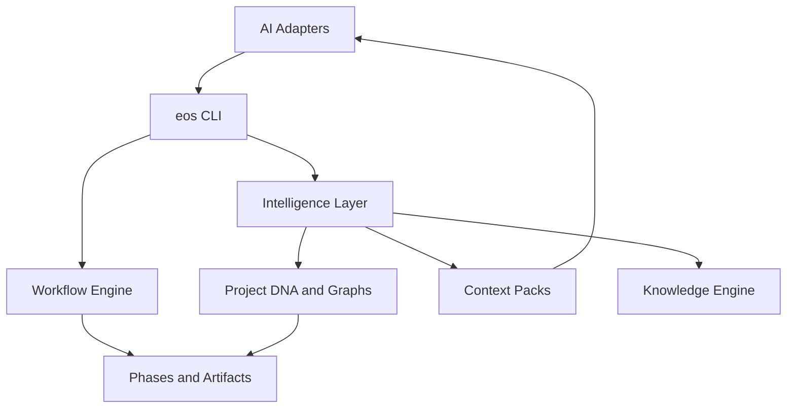
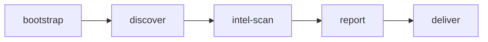
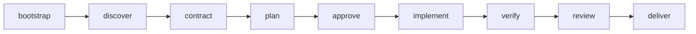

# Phase 2 Closeout — Engineering Intelligence

## 1. Architecture changes made

- Added an **Intelligence layer** under `engine/src/intelligence/` without replacing the Phase 1 workflow engine.
- Extended the CLI with `eos intel *`, `eos context`, and `eos knowledge *` while keeping all Phase 1 commands intact.
- Introduced consumer path `.engineering-os/intelligence/` for Project DNA, summaries, graphs, and context packs.
- Added workflow `repository-bootstrap` and phase `intel-scan`.
- Enriched `feature-development`, `bug-fix`, and `refactoring` plan requirements with `feature-impact` and `reuse-analysis`.
- Expanded `backend-dependency` and `verification-plan` templates in place.
- Evolved the knowledge base into a searchable indexable system (framework + consumer overlay).

## 2. New capabilities added

1. **Repository Intelligence** — `eos intel scan` → Project DNA + reuse inventory + summaries  
2. **Feature Impact Analysis** — `eos intel impact`  
3. **Component Reuse Intelligence** — `eos intel reuse` with ranked decisions  
4. **Backend Contract Intelligence** — expanded Backend Dependency template  
5. **Verification Intelligence** — verification matrix in Verification Plan  
6. **Dependency Graphs** — shared components, API, routes, state  
7. **Knowledge Engine** — index/search/add across lessons, bugs, patterns, ADRs  
8. **Prompt Context Optimization** — `eos context` + automatic pack from `eos next`  
9. **Repository Bootstrap** — `repository-bootstrap` workflow  
10. **Change Impact Analysis** — `eos intel change-impact <path>`  

## 3. Updated workflow diagrams

### Repository Bootstrap

### Feature Development (Phase 2)

Plan phase now consumes DNA/graphs and requires feature-impact + reuse-analysis + expanded verification/backend artifacts.

## 4. Remaining roadmap items (future milestones)

- Language-server / AST-grade dependency analysis beyond heuristic import parsing  
- Embeddings or semantic search for the knowledge engine  
- Automated verification matrix fill from executed test reports  
- PR bot integration that comments change-impact on diffs  
- Multi-package monorepo DNA segmentation per workspace package  
- Visual graph UI (outside CLI) for regression planning  
- Policy packs (org-specific standards overlays distributed as plugins)

## 5. Suggestions for future extensibility

- Add new intelligence providers as modules under `engine/src/intelligence/` and register CLI subcommands only  
- Keep workflows declarative: new required artifacts should be templates + YAML phase entries  
- Prefer generating markdown/JSON evidence artifacts agents can cite  
- Maintain adapters as thin pointers to CLI/context packs — never fork workflow logic per tool  
- Version intelligence JSON (`project-dna.json` already has `version`) for forward migrations  
